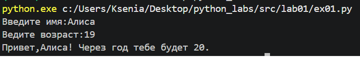
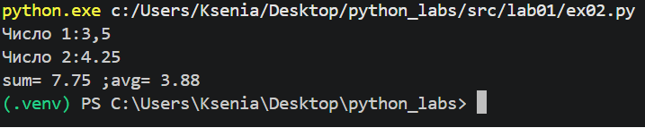
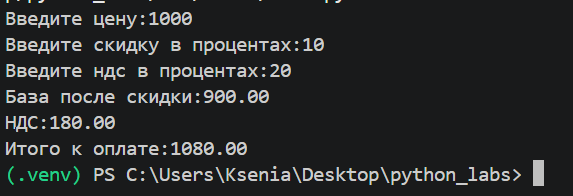
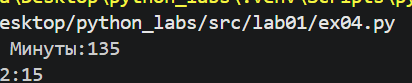
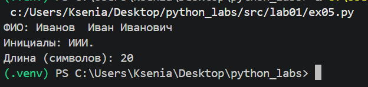
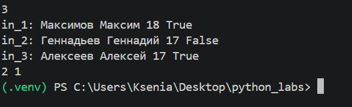

# python_labs
# Лабараторная работа 1

## Задача 1
# Программа принимает имя и возраст,далее с помощью f-строки выводит их.

## Задача 2
# Программа принимает 2 числа, затем исправляет запятую на точку, далее выводит сумму и ср.знач(округляя до двух знаков после запятой). 

## Задача 3
# Программа принимает три числа, рассчитывает по формулам значения и выводит их c помощью f-строки(округляя до двух знаков после запятой).

## Задача 4
# Программа принимает целое число минут, рассчитывает количество часов и минут (целочисленное деление на 60 и остаток от деления на 60), выводит с помощью f-строки.

## Задача 5
# Программа принимает ФИО, создает список из трех эл-тов с очисткой от пустых значений, затем собирает список обратно в строку(вставляя ровно 1 пробел), далее пребирает каждое слово, берет первый симвл слова, переводит в верхний регистр, склеивает все первые буквы без пробелов, добавляет точку. Вывод 

## Задача 6
# Программа N раз спрашивает у пользователя строку. В каждой строке смотрит на последнее слово: если это True,то считает, что человек был на очном, если False,то на заочном. В конце показывает, сколько раз получилось очных/заочных.

