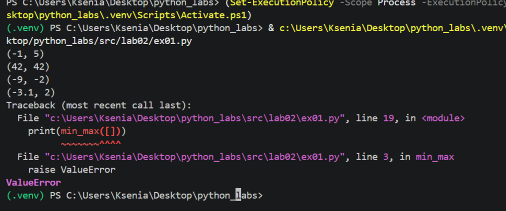
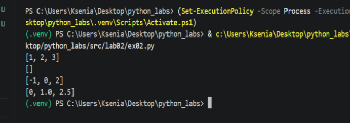
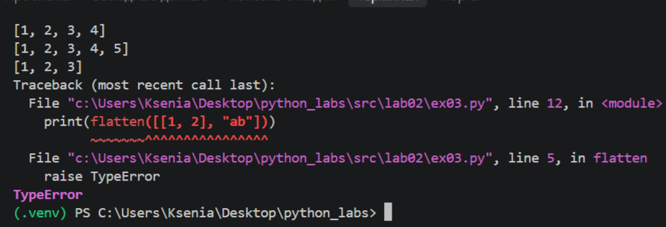
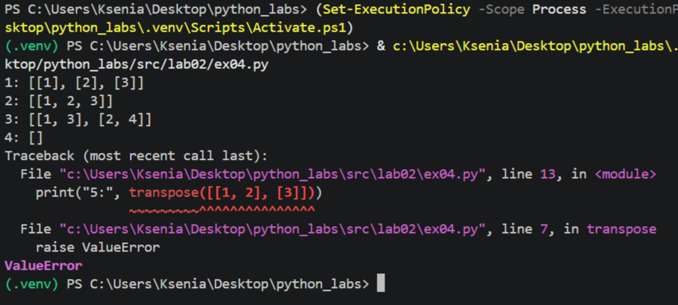
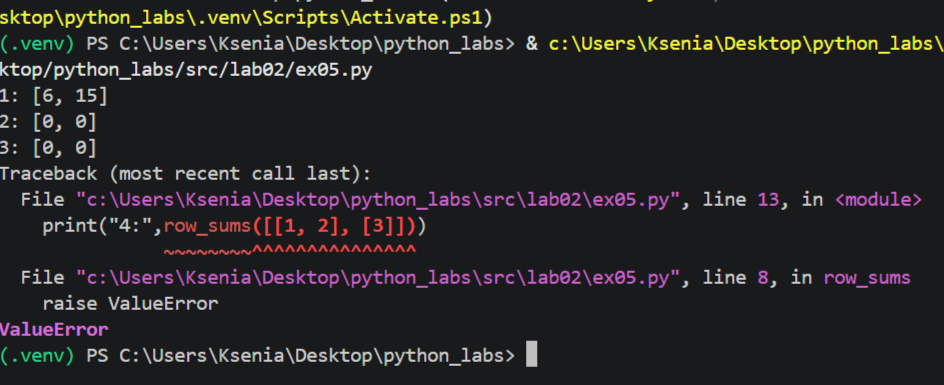
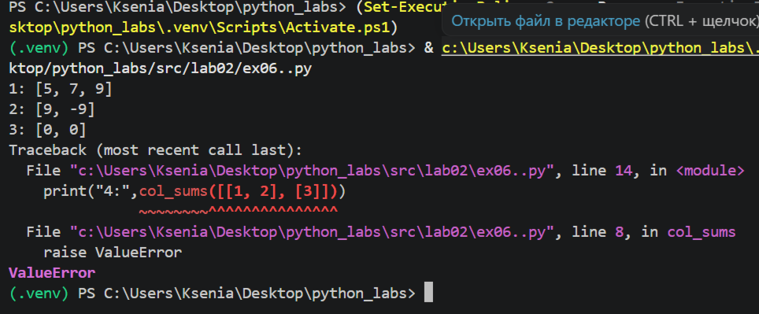
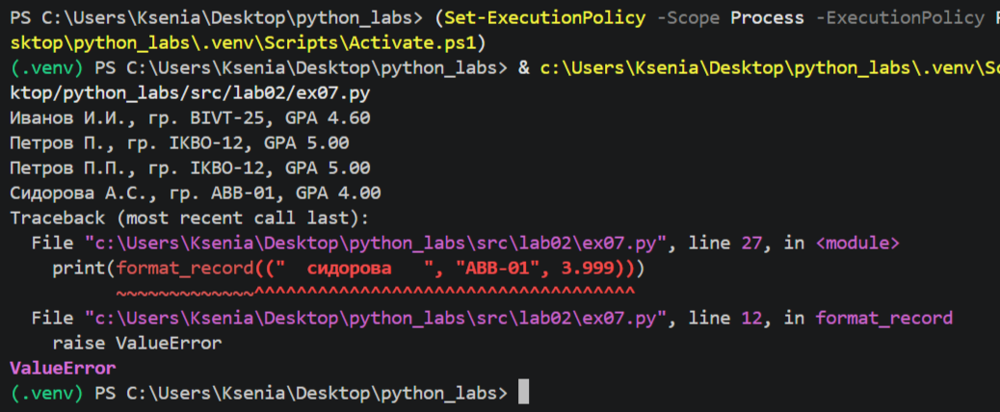

# python_labs
# Лабараторная работа 2

## Задача 1
```python
def min_max(nums: list[float | int]) -> tuple[float | int, float | int]:
    if not nums:
        raise ValueError
    
    min_num=nums[0]
    max_num=nums[0]
    
    for num in nums:
        if num<min_num:
            min_num=num
        if num>max_num:
            max_num=num
    return (min_num, max_num)

print(min_max([3,-1,5,5,0]))
print(min_max([42,42]))
print(min_max([-5,-2,-9]))
print(min_max([1.5,2,2.0,-3.1]))
print(min_max([]))
```


## Задача 2
```python
def unique_sorted(nums: list[float | int]) -> list[float | int]:
    unique=list(set(nums))

    n= len(unique)
    for i in range(n):
        for j in range(0,n-i-1):
            if unique[j]>unique[j+1]:
                unique[j],unique[j+1]=unique[j+1],unique[j]
    return unique

print(unique_sorted([3,1,2,1,3]))
print(unique_sorted([]))
print(unique_sorted([-1, -1, 0, 2, 2]))
print(unique_sorted([1.0, 1, 2.5, 2.5, 0]))

```


## Задача 3
```python
def flatten(mat: list[list | tuple]) -> list:
    result = []
    for row in mat:
        if not isinstance(row, (list, tuple)):
            raise TypeError
        for item in row:
            result.append(item)
    return result
print(flatten([[1, 2], [3, 4]]))
print(flatten([[1, 2], (3, 4, 5)]))
print(flatten([[1], [], [2, 3]]))
print(flatten([[1, 2], "ab"]))
```


## Задача 4
```python
def transpose(mat: list[list[float | int]]) -> list[list]:
    if not mat: 
        return []
    n =len(mat[0])
    for row in mat:
        if len(row)!=n:
            raise ValueError
    return [[mat[i][j] for i in range(len(mat))]for j in range(n) ]
print("1:", transpose([[1, 2, 3]]))
print("2:", transpose([[1], [2], [3]]))
print("3:", transpose([[1, 2], [3, 4]]))
print("4:", transpose([]))
print("5:", transpose([[1, 2], [3]]))
```


## Задача 5
```python
def row_sums(mat: list[list[float | int]]) -> list[float]:
    if not mat:
        return []
    
    n=len(mat[0])
    for row in mat:
        if len(row)!=n:
            raise ValueError
    return [sum(row) for row in mat]
print("1:",row_sums([[1, 2, 3], [4, 5, 6]]))
print("2:",row_sums([[-1, 1], [10, -10]]))
print("3:",row_sums([[0, 0], [0, 0]]))
print("4:",row_sums([[1, 2], [3]]))
```


## Задача 6
```python
def col_sums(mat: list[list[float | int]]) -> list[float]:
    if not mat:
        return []
    
    n = len(mat[0])
    for row in mat:
        if len(row) != n:
            raise ValueError
    
    return [sum(mat[i][j] for i in range(len(mat))) for j in range(n)]
print("1:",col_sums([[1, 2, 3], [4, 5, 6]]))
print("2:",col_sums([[-1, 1], [10, -10]]))
print("3:",col_sums([[0, 0], [0, 0]]))
print("4:",col_sums([[1, 2], [3]]))
```


## Задача 7
```python
def format_record(rec: tuple[str, str, float]) -> str:
    if not isinstance(rec,tuple) or len(rec)!=3:
        raise ValueError
    fio, group, gpa = rec

    if not isinstance(gpa, (int, float)):
        raise TypeError
    if not (0.0 <= gpa <= 5.0):
        raise ValueError

    fio = " ".join(fio.split())
    parts = fio.split()
    if len(parts) < 2:
        raise ValueError

    surname = parts[0].capitalize()
    initials = "".join(name[0].upper() + "." for name in parts[1:])

    group = group.strip()
    if not group:
        raise ValueError

    return f"{surname} {initials}, гр. {group}, GPA {gpa:.2f}"

print(format_record(("Иванов Иван Иванович", "BIVT-25", 4.6)))
print(format_record(("Петров Пётр", "IKBO-12", 5.0)))
print(format_record(("Петров Пётр Петрович", "IKBO-12", 5.0)))
print(format_record(("  сидорова  анна   сергеевна ", "ABB-01", 3.999)))
print(format_record(("  сидорова   ", "ABB-01", 3.999)))
```
